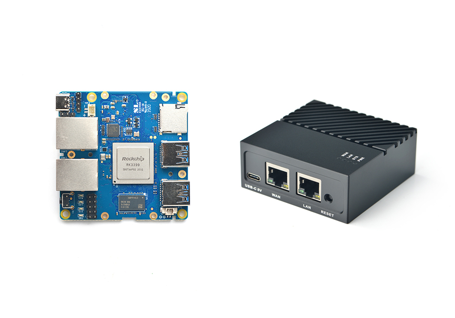
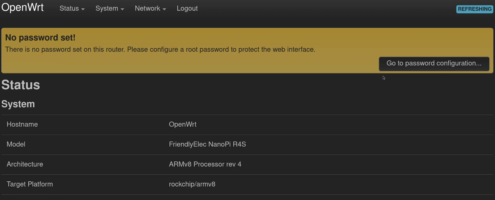
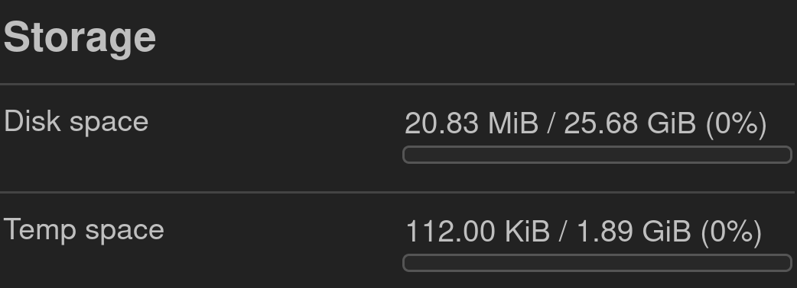
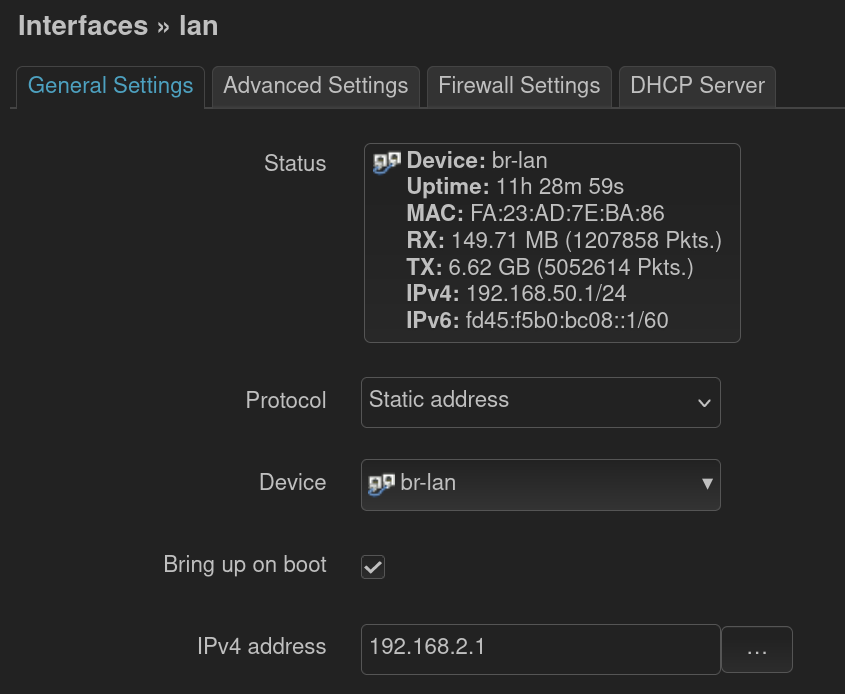
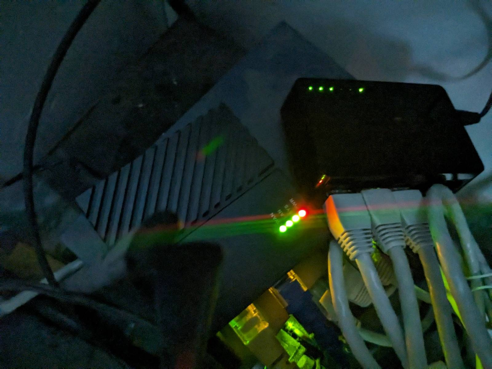

# Introducción

## Pequeñas notas sobre terminología

Para que no haya dudas sobre los términos que se están utilizando en este
reporte, y en la exposición en sí, debe hablarse un poco de con qué significado
se utilizarán diferentes términos, que, aunque quizás no del todo correcto,
permitirán por lo menos saber de *qué* se habla:

- *Computadora*: Básicamente cualquier dispositivo electrónico que implemente
  la arquitectura von Neumann, o alguna similar, es decir, que tenga una memoria
  y una unidad de procesamiento central.
- *Firmware*: Pieza de software de bajo nivel que controla el funcionamiento de
  una computadora.
- *Router*: una computadora que forma parte de una red y que se encarga de
  comunicar una red local (*LAN*) con una red "más grande", como el "Internet"
  (*WAN*).
- *Switch*: es un aparato que, dentro de una misma red, conecta a los clientes
  de la misma. Se puede pensar en un switch como un conmutador (aunque no lo
  es).
- *Punto de acceso inalámbrico (WAP)*: Dispositivo que se encarga de proveer una
  conexión WiFi a las computadoras de una red.
- *Firewall*: Dispositivo (ya sea hardware o un programa) 

En una red casera real, suele haber un *router* que conecta la red de la casa
con el *internet*. A él, esta conectado uno o varios *switches* y *WAPs* a los
que a su vez están conectadas las diferentes computadoras que forman parte de la
red. Muy comúnmente, un *router*, *switch* y *WAP* se encuentran consolidados en
un sólo dispositivo al que, en conjunto, se le llama también un *router*.

## ¿Qué es OpenWRT?

OpenWRT es un sistema operativo basado en el kernel de Linux diseñado para su
uso en sistemas embebidos, específicamente aquellos cuyo propósito sea el manejo
de tráfico en una red. El sistema es libre y de código abierto. Se trata de,
quizás, una de las distribuciones de Linux más conocidos para su uso en
*routers* y puntos de acceso domésticos [@willis-2016].

## Historia y razón de su existencia

El proyecto surgió a raíz del código fuente un *router* de Linksys, el famoso
(en aquella época) *WRT54G*. La razón de que se tuviera acceso a la fuente era
que, en 2003, Andrew Miklas descubrió que el *firmware* que el dispositivo
contenía el código de muchos proyectos originalmente publicados bajo la licencia
GPL. Debido a los términos de esta licencia, Linksys se vio obligado a hacer
disponible el *firmware* entero del *router*.

Gracias a lo anterior, muchas personas lograron aprender cómo mejorar las
capacidades de este pedazo de equipamiento. Muchas de estas mejoras lograron que
el *WRT54G* hiciera cosas que no podía (por omisión de Linksys) anteriormente.
Eventualmente, algunas de las versiones derivadas del *firmware* original se
consolidaron en lo que hoy es OpenWRT y, posteriormente, se expandió la lista de
*hardware* donde se puede instalar.

## Diferencias con otros sistemas

Simplificando de sobremanera la discusión, OpenWRT no es más que una
distribución de Linux, como lo sería Debian, RHEL u OpenSUSE. Sin embargo, el
desarrollo de OpenWRT no está enfocado en el cómputo general, como sí lo están
las distribuciones antes mencionadas.

Hay otros sistemas que también tiene el objetivo de instalarse en computadoras
que forman parte de la infraestructura de una red. Uno de estos sistemas, basado
en FreeBSD, es pfSense, aunque su uso está más bien orientado a usuarios más
avanzados y su instalación en equipo más sofisticado. Por ejemplo, hasta hace
unos años, pfSense no estaba disponible en procesadores con la arquitectura
*arm*, como sí lo ha estado OpenWRT [@kennedy-2017].

OpenWRT se enfoca en su uso para computadoras embebidos, mientras que este
ámbito no está tan atendido (si es que lo está) en otros sistemas. El tipo de
computadoras utilizadas en estos sistemas suele ser de "baja velocidad" (un
*router* casero o un *firewall* no tiene procesadores tan sofisticados como una
computadora de escritorio moderna).

Lo anterior significa que, por necesidad, OpenWRT es un sistema mucho más ligero
que la mayoría de las alternativas. Muestra de esto son sus requisitos
recomendados; no son necesarios más que 8 MB de almacenamiento y 64 MB de
memoria RAM para que, según sus desarrolladores, el sistema funcione de manera
estable para usos simples.


## El papel de OpenWRT en una red doméstica

Dadas sus características y objetivos de desarrollo, OpenWRT es ideal para su
instalación en *routers* caseros cuyo *firmware* no de el ancho, sea demasiado
antiguo como para considerarse seguro, o para "liberar" la red de una casa
(liberar en el sentido de que se minimice el uso de software privativo). En ese
sentido, OpenWRT puede utilizarse para traer capacidades más modernas a
un antiguo *router*, o para convertir una computadora común en un *router*.

Debido a que OpenWRT es "simplemente" una distribución de Linux, y que tiene un
sistema de archivos con permisos de escritura, los usuarios pueden modificar
cualquier archivo e instalar el software adicional que deseen.

Por ejemplo, puede utilizarse una computadora con OpenWRT para que, además de
cumplir su función como *router*, ejecute otro software y funcione como servidor
en la red local. Quizás un servidor *DNS* local para poder referirse a las
computadoras de la red por un nombre en lugar de su dirección IP. Otro uso
posible es una página web local, o un servidor de archivos para que todas las
computadoras puedan acceder a ellos e incluso hacer respaldos.

Reiterando un poco, OpenWRT es una distribución Linux, y puede hacer lo que
se esperaría que Linux puede hacer. De un momento a otro, un simple *router* se
convierte en una computadora completa, con todas las posibilidades que ello trae
consigo.

# Ejemplo de uso en la casa de uno de los expositores

El *router* de la casa de uno de los expositores tiene software ya viejo: la
última actualización de *firmware* para el mismo ya tiene cuatro años de
antigüedad recién cumpliditos[^1]. Conectar una computadora a internet con
software que lleva años sin actualizarse no parece la mejor de las ideas, mucho
menos si se trata del componente central de la red de una casa.

Dado que no hay más *firwmare* oficial que instalar al *router*, parece una
buena idea instalar OpenWRT para evitar que esta situación se repita. Se compró
una nueva computadora para instalar el sistema ahí (no quería arriesgar
*brickear*[^2] el único *router* de la casa).

Esta computadora es una NanoPi R4S, una computadora de una sola placa[^3] que
cuenta con 4 GB de memoria RAM y un procesador de arquitectura *ARM* de seis
núcleos. Adicionalmente, se compró una memoria micro SD de 32GB para fungir como
almacenamiento del sistema[^4].



Si estas características se comparan con las del *router* viejo, un *ASUS
RT-AC1200*, con 16 MB de memoria *flash* como almacenamiento y 64 MB de RAM.
Queda claro que las capacidades de la computadora nueva permitirán que no
solamente trabaje como *router*, sino potencialmente como un servidor para la
red local, aunque ese uso sale de los objetivos de este trabajo.

La NanoPi tiene dos interfaces *Ethernet*, una para *WAN* y otra para *LAN*.
Esto significa que, para conectar más de una computadora al *router*, es
necesario utilizar un *switch*, aunque ya se contaba con uno así que esto no
presentó un problema.

Adicionalmente, la computadora nueva no cuenta con capacidades inalámbricas, por
lo que se utilizará al viejos Asus como punto de acceso inalámbrico.
Naturalmente, resulta incómodo quitar querer deshacerse del viejo equipo para
después volverlo a agregar. A pesar de todo, mover al RT-AC1200 de un rol
principal a uno secundario hará que *brickearlo* al instalarle OpenWRT en un
futuro no sea una catástrofe tan grande como lo sería de otra manera.

[^1]: https://www.asus.com/us/supportonly/rt-ac1200/helpdesk_bios?model2Name=RT-AC1200

[^2]: https://en.wikipedia.org/wiki/Brick_(electronics)

[^3]: https://en.wikipedia.org/wiki/Single-board_computer

[^4]: No es ideal utilizar una memoria SD como almacenamiento principal de un
    sistema operativo basado en Linux, por el desgaste que sufrirá, por lo que
    este punto podría tratar de mejorarse en el futuro.

## Instalación

Si uno navega a la página de documentación[^5] de OpenWRT correspondiente a la
NanoPi R4S, puede descargar la imagen que deberá ser "grabada" en la tarjeta SD
para poder arrancar el sistema. Tras ir al apartado de *instalación*, se debe
descargar la imagen marcada como *Factory image*.


La imagen puede, posteriormente, ser descomprimida y escrita en la memoria SD,
que se supone ya conectada a la computadora desde la que se descargó OpenWRT,
con comandos como los siguientes:

```sh
gzip -d openwrt....img.gz
sudo cp openwrt....img /dev/la-mem
```

Una vez termine de ejecutar el segundo comando, puede extraerse la memoria y
conectarse la NanoPi. Tras conectar el nuevo *router* a la corriente y utilizar
un cable de *Ethernet* para conectarlo una computadora para poder iniciar con la
configuración básica del aparato.

[^5]: https://openwrt.org/toh/friendlyarm/nanopi_r4s_v1

## Configuración básica

OpenWRT incluye un sistema para centralizar las configuraciones de los distintos
sistemas que componen al sistema base, este sistema se llama UCI (*Unified
Configuration Interface*). Existe una interfaz web para interactuar con UCI sin
necesidad de utilizar la línea de comandos, llamada LuCI. La mayoría de la
configuración hecha esta vez, que no fue mucha, se hizo desde LuCI.

Usando la computadora conectada al *router*, uno puede utilizar un navegador web
para entrar a la interfaz web (en la dirección 192.168.1.1), donde se verá la
pantalla de inicio de sesión (las credenciales por defecto son `root`, `root`).


### Cambiando la contraseña del superusuario

Es necesario cambiar la contraseña del usuario `root`, pues de lo contrario
sería muy fácil que otra persona acceda a la configuración del *router* y haga
cosas que no se deseen. De hecho, LuCI advierte de esto y, al dar click al botón
del gran aviso amarillo, puede hacerse el cambio.



### Expandiendo el sistema de archivos

Por defecto, ya que no es posible predecir el tamaño de la tarjeta en la que se
instalará el OpenWRT, el sistema de archivos sólo abarca ciento y pico
*MegaBytes*. 


Como la tarjeta utilizada tiene una capacidad de 32 GB, debería
expandirse el mismo. Para esto se necesitan unos programas que no vienen por
defecto en el sistema, por lo que se tiene que usar el gestor de paquetes de
OpenWRT, `opkg`, esta configuración se basa en la descrita en
[@unknown-author-no-dateB].

Tras iniciar una conexión SSH[^6] al *router*, utilizando las mismas
credenciales que en la interfaz web, se ejecutarán los siguientes comandos:

```sh
opkg install parted tune2fs resize2fs
```

Después, se usará `parted` para expandir la partición al tamaño deseado (acá se
está intentando expandir `/dev/mmcblk1p2`, montado en `/`)

```
parted
p
resizepart 2 27GB
q
```

También se repararán errores en el dispositivo en caso de que hayan surgido (la
imagen utilizada en este caso tenía un sistema `ext2` en la partición montada en
`/`):

```
mount -o remount,ro /
tune2fs -O^resize_inode /dev/mmcblk1p2
fsck.ext2 /dev/mmcblk1p2
```

Después de reiniciar la computadora, se ejecuta:

```
resize2fs /dev/mmcblk1p2
```

Después de esto, tanto la partición como el sistema de archivos tendrán un
tamaño más adecuado:



[^6]: https://en.wikipedia.org/wiki/Secure_Shell

### Cambiar dirección IP del *router*

Para evitar colisiones de direcciones IP entre el *router* existente y el nuevo,
es buena idea cambiar la dirección IP del nuevo. Esto se hará, en este caso,
desde LuCI. En la interfaz, siguiendo los menús `Network>Interfaces>LAN>Edit`
puede cambiarse la interfaz web:



### Conexión a la *WAN*

Ahora que se han hecho las configuraciones básicas, puede conectarse el *router*
a la *WAN* o al internet, de la misma manera en la que ya se encontraba
conectado el *router* viejo.



### Usando el viejo *router* como *WAP*

Tras iniciar sesión en el viejo *router*, puede activarse el modo *AP*, para que
deje de trabajar como un *router* completo, y ahora sólo funcione su modalidad
de punto de acceso. 


## Pruebas de uso

Con las configuraciones ya hechas, ya es posible establecer conexiones tanto en
internet como entre las computadoras de la red. Y es así, si uno ejecuta el
comando `ping` desde alguna de las computadoras de la red, se verá que las
conexiones funcionan correctamente:

```
$ ping gwolf.org
PING gwolf.org (...) 56(84) bytes of data.
64 bytes from ...
...
^C
--- gwolf.org ping statistics ---
4 packets transmitted, 4 received...
rtt min/avg/max/mdev = 56.603/56.68...
```

En general, desde el punto de vista de un usuario normal en la red, no existe
ninguna diferencia notable entre el funcionamiento de los dos *routers*. Es
bueno que no haya una reducción en el rendimiento percibido, y es natural que no
haya una mejora, pues la conexión a internet contratada en la casa no es lo
suficientemente alta como para que el equipo de la red haya hecho una
diferencia.

# Conclusiones

Durante el proceso descrito en este trabajo, fue posible ver cómo OpenWRT puede
utilizarse en una red casera. Si bien no hay suficiente tiempo en la exposición
para **mostrar** todas las ventajas que hacer esto trae, sí pudo constatarse que
utilizar otro sistema operativo para el *router* es posible, y que el
rendimiento de la red no empeorará. Conocer sistemas como estos nos ayuda a
darnos cuenta de que lo que nos dan las diferentes empresas no son las únicas
opciones para gestionar las redes de nuestras casas. La instalación y uso de
este sistema, también sirve como un buen proyecto para aprender algunos
conceptos básicos sobre la administración de sistemas y sobre redes de
computadoras.

# Fuentes consultadas
